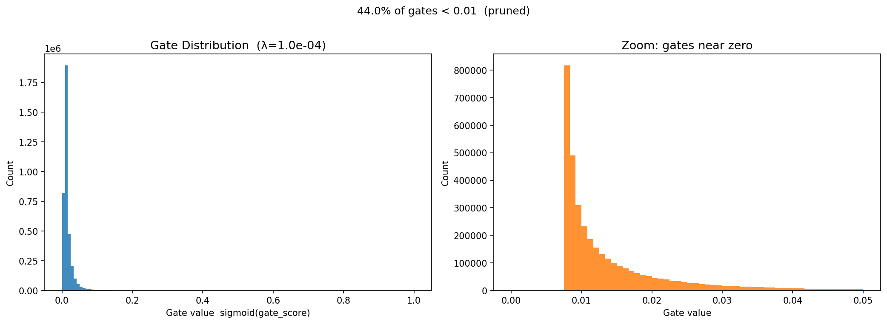

# Self-Pruning Neural Network (CIFAR-10)

This repository contains an implementation of a self-pruning neural network using learnable gate parameters per weight.

## What We Implemented
The core file is [self_pruning_cifar10.py](self_pruning_cifar10.py), which implements:

- A custom `PrunableLinear` layer (no direct `nn.Linear` usage for the prunable blocks)
- Gate scores with sigmoid transformation to produce gates in `[0, 1]`
- Elementwise weight gating (`weight * gate`)
- Training objective:
  - Classification loss (cross-entropy)
  - Plus L1-like sparsity penalty on gate values
- Evaluation across multiple lambda values
- Reporting of test accuracy and sparsity percentage
- Output artifacts: CSV, Markdown report, and gate histogram

## Approach
1. Build a feed-forward MLP from `PrunableLinear` layers.
2. For each forward pass, compute gated weights.
3. Add sparsity pressure by summing all gate values across prunable layers.
4. Train with Adam on CIFAR-10.
5. Evaluate each lambda setting and compare sparsity vs accuracy.

## Current Results
From [outputs/results.csv](outputs/results.csv):

| Lambda | Test Accuracy (%) | Sparsity Level (%) |
|---:|---:|---:|
| 1.00e-06 | 52.99 | 0.00 |
| 1.00e-05 | 55.77 | 8.51 |
| 1.00e-04 | 57.49 | 44.02 |

Interpretation:
- Larger lambda produced stronger pruning.
- In this run, stronger pruning also improved accuracy.

Gate distribution for the best lambda run:



## How To Run
Use an activated virtual environment and run:

```bash
python self_pruning_cifar10.py --device cpu --epochs 25 --num-workers 4
```

Or specify your own lambdas:

```bash
python self_pruning_cifar10.py --device cpu --epochs 8 --lambdas 1e-6,1e-5,1e-4 --num-workers 4
```

## Output Files
After training, check:

- [outputs/results.csv](outputs/results.csv)
- [outputs/report.md](outputs/report.md)
- [outputs/best_model_gate_distribution.png](outputs/best_model_gate_distribution.png)
- [FINAL_REPORT.md](FINAL_REPORT.md)

## How We Can Improve Further
1. Better architecture for CIFAR-10
Use a convolutional backbone with channel-wise pruning for stronger baseline accuracy.

2. More robust pruning objective
Try hard-concrete gates or straight-through binary gates for closer-to-exact zero pruning behavior.

3. Hyperparameter search
Run a wider lambda sweep and longer schedules, then select by Pareto frontier (accuracy vs sparsity).

4. Stronger training recipe
Consider data augmentation and scheduling in a separate experimental branch to improve absolute accuracy.

5. Structured compression metrics
Add parameter/FLOPs reduction reporting and inference latency measurements for deployment relevance.

## Notes
- This repo also includes [sdap_inspired_cnn_pruning.py](sdap_inspired_cnn_pruning.py) as an additional experimental variant.
- The assignment-compliant baseline implementation is [self_pruning_cifar10.py](self_pruning_cifar10.py).
